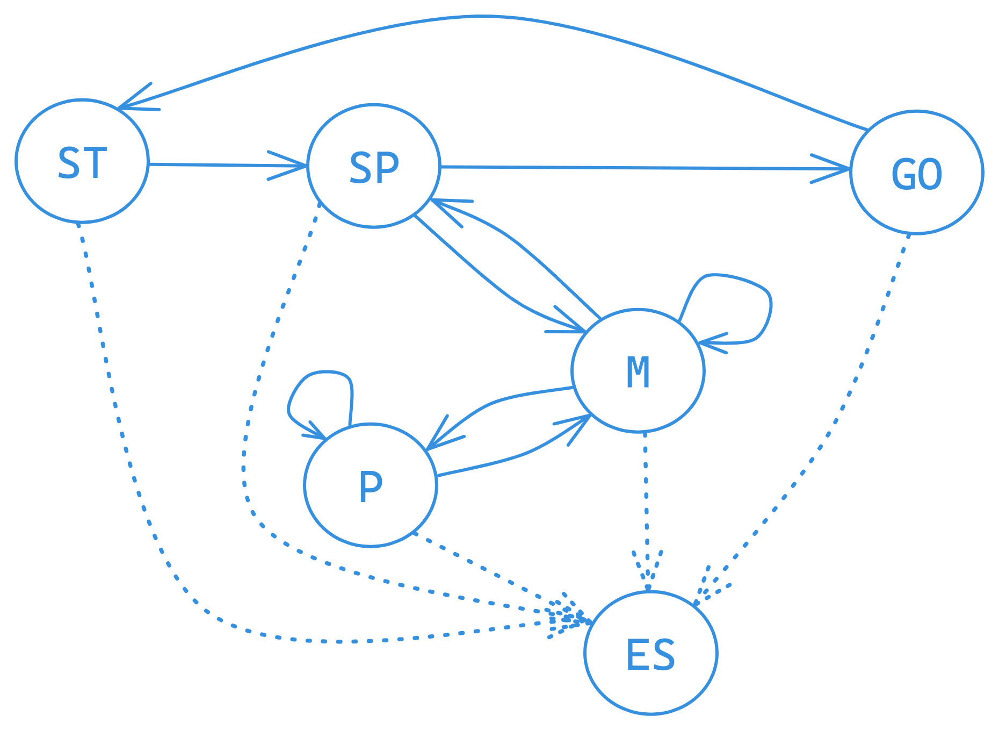

## О проекте:
Реализован обычный Tetris, работающий в терминале с помощью библиотеки **`ncurses`**. На данный момент игра работает **только** на Linux системах.

Логика работы устроена на основе конечных автоматов (finite state machine). 

Схема FSM:

- ST - start
- SP - spawn
- M - move
- P - pause
- GO - game over
- ES - exit state

Закрыть игру можно на любой стадии.

Во время состояния "start" устанавливается начальные параметры, игра готовка к старту и ожидается только желание пользователя начать игру.

"spawn" - создаёт новый блок из 4-х квадратов (далее тетрамино), которым управляет игрок и переводит в основное состояние "move", или, если создать новое тетрамино помешали старые - происходит перевод на состояние "game over".

"move" - основное состояние, при котором пользователь может управлять новым тетрамино; большая часть времени проводится именно в этом состоянии.

"pause" - состояние, при котором игра приостанавливается и ждёт от пользователя запроса на продолжение игры. Может быть вызвано только во время состояния "move", и туда же возвращает.

"game over" - состояние, при котором игра завершается, в результате отсутствия места под новое тетрамино. Количество очков сохраняется, игра переводится в состояние "start" для новой игры.

"exit state" - завершение игры.

## Управление:
Arrows (стрелки):
  - Left - передвинуть тетрамино влево; 
  - Right - передвинуть тм вправо; 
  - Down - передвинуть тм вниз.
  
Общие:
  - Enter - начать игру (или выйти с паузы);
  - ESC - закрыть игру; 
  - Space - действие (поворот фигуры);
  - 'p' - пауза; 
  - 'c' - показать/спрятать управление.

---
## Как использовать проект.
В проекте есть Makefile, в котором основные стадии: `install`, `uninstall`, `dvi`, `dist`, `clean`.

Стадия `install` - собирает проект и сохраняет в директории `src/games`. (вызывается как `make install` в директории с файлом).

`uninstall` - удаляет всё созданное проектом, в том числе сохранение рекорда очков.

`dvi` - запускает автоматическую документацию с помощью doxygen и сохраняет в `src/docs`. Открыть документацию можно стадией "dvi_open" или открыв файл `src/docs/index.html`.

`dist` - собирает проект и запаковывает в tar архив.

`clean` - чистит всё от сборки и архивации от стадии "dist".

--- 
## Директории
`gui` - директория, в которой храниться базовая реализация "графики".

`brick_game` - содержит основную логику игры.
`brick_game/backend` - содержит базовую реализацию beckend-а игры.
`brick_game/tetris` - содержит всю реализацию конкретно для Tetris, в том числе специфичные расширения для frontend (gui) и backend.

`games` - директория, куда собирается проект.
`games/games_data` - место где хранятся нужные игре сохранения (без шифрования).

`docs` - авто документация к проекту.

`tests` - тесты для основной логики Tetris-а.